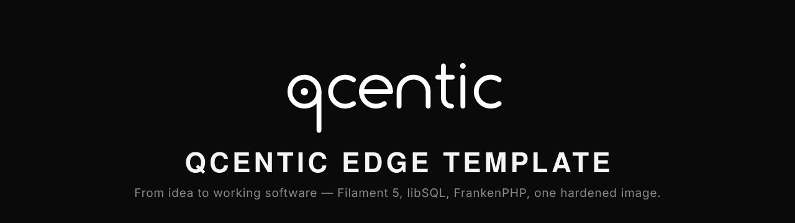

<p align="center">
  
</p>

<p align="center">
  <a href="LICENSE"></a>
  
  
  
  
  
</p>

# Qcentic Edge Template

**From idea to working software — fast.** A production-ready [Filament](https://filamentphp.com) 5.x / Laravel 13 template, packaged as one hardened Docker image with three Compose stacks (dev, prod, build), and **libSQL** as the database everywhere.

## Why this template exists

[Qcentic](https://qcentic.com/) is a consolidation company. We deliver technical consultation, software, and SaaS to SMEs and enterprises — and for us, **speed of prototyping and speed of delivery** matter more than anything. Our clients often don't need a big, sophisticated platform. They need a smaller solution that is real on day one: sometimes a lean MVP, sometimes a little more than an MVP — always something that runs cheaply, is easy to operate, and can live on the edge.

We built this template so a clone is already a working application, not a starting ceremony. If your goal is to ship an MVP, a small application, or a small SaaS very fast — and you want strong opinions already made for you — this is for you.

### Why Filament

Filament gives an enormous amount of product for free: a full admin panel, forms, tables, infolists, actions, notifications, widgets, and a plugin ecosystem — all on top of Laravel, with first-class authorization. For "small solution, real features" work, nothing else in the PHP world ships this much this fast. The template targets **Filament 5.x only**.

### Why libSQL

[libSQL](https://github.com/tursodatabase/libsql) is the open fork of SQLite built for the edge: embedded replicas, HTTP access, and a growing set of managed providers — [Turso](https://turso.tech/), [Bunny Database](https://bunny.net/docs/database/quickstart), or your own `sqld`. One database technology covers local dev, CI, and global production, with session, cache, and queue all on the database driver. **Zero extra services** to run or pay for.

### Why FrankenPHP, and why the Docker image looks like this

[FrankenPHP](https://frankenphp.dev/) runs Laravel on a modern app server (worker mode, HTTP/2, HTTP/3) in a single process — no nginx + PHP-FPM pair to babysit. We package it as one multi-stage image:

- **One service, not five.** App, queue worker, and scheduler all come from the same image. A small VPS or a single Magic Container runs the whole product.
- **Debian base, deliberately.** The libSQL PHP client loads a glibc native library through FFI; no musl build exists, so Alpine is out. We sized the image around that constraint instead of fighting it.
- **Hardened by default.** Non-root (`uid 1000`), read-only root filesystem, no capabilities, opcache with `validate_timestamps=0`. Dev dependencies and Node never reach the production image.

The result: clone, `docker compose up`, and you have an admin panel, OAuth2 API, media drive, realtime, and object storage — in minutes, not sprints.

## What's inside

- **Filament 5 admin panel** (`/admin`) + app panel, Spatie roles (`super_admin` / `user`) + Filament Shield (no `is_admin` flag)
- **Media Drive plugin** (`packages/filament-media-drive`) — first-party Drive page (grid/list) + picker field on Spatie Media Library / `s3` disk
- **Laravel Passport OAuth2** — personal access tokens, authorization code, refresh, and client credentials. Password grant is off. Signing keys come from `PASSPORT_PRIVATE_KEY` / `PASSPORT_PUBLIC_KEY` (PEM in env). Panel login stays email/password session. Mint PATs from the user menu (**API tokens**).
- **First-run installer** (`mamenein/filament-installer`) — `/install` checklist + migrate/seed/first user for Magic Containers (no shell). Cookie sessions until locked.
- **FrankenPHP 1.12 / PHP 8.4** runtime (Debian base — the libSQL client's native library is glibc-only), non-root (`uid 1000`), read-only root filesystem, no capabilities, opcache with `validate_timestamps=0` (immutable-code optimizations)
- **libSQL database layer** via [turso/libsql-laravel](https://github.com/tursodatabase/libsql-laravel), installed from the Laravel 13-compatible fork [mehdiamenein/libsql-laravel](https://github.com/mehdiamenein/libsql-laravel) (constraint + runtime fixes; FFI-based client). Session/cache/queue all use the `database` driver on libSQL — zero extra services. Reverb scale-out is the exception: it needs Redis (there is no database persister).
- **Multi-stage Docker build**: dev dependencies and node never reach the production image; frontend assets are compiled once and copied in as `public/build`
- **Three Compose files**:

| File | Purpose |
|---|---|
| `docker-compose.dev.yml` | Local development: bind-mounted source, Vite HMR on `:5173`, `artisan serve` on `:8090`, local libSQL server (`sqld`) on `:8181`, MinIO on `:9000` (API) / `:9001` (console), Reverb on `:8081`, hot reload for PHP + assets. Optional Redis via `--profile redis` |
| `docker-compose.prod.yml` | Production: runs a published image (read-only, hardened), one-shot migrate, queue worker, scheduler, Reverb against a remote libSQL database (Bunny Database, Turso, or your own sqld). Optional bundled sqld via `--profile bundled-db`. Optional Redis via `--profile redis` |
| `docker-compose.build.yml` | Builds the production image locally (default `linux/amd64`). Nothing is pushed unless you explicitly run `build --push` with your own registry user |

## Quick start (dev)

```bash
cp .env.example .env
# clones: set a unique COMPOSE_PROJECT_NAME in `.env` (or export it).
# Compose interpolates `name:` from `.env` / the shell — not from `--env-file`.
# Do not edit docker-compose.dev.yml. Default is qcentic-edge-template-dev.

cp .env.docker.dev.example .env.docker.dev
# fill in APP_KEY (see comment in the file)

docker compose -f docker-compose.dev.yml --env-file .env.docker.dev up -d
```

First `up` bind-mounts `./app` and uses named volume `composer_vendor` for `/app/vendor`. The dev entrypoint runs `composer install` when `/app/vendor/autoload.php` is missing — no manual `compose exec … composer install`. `node_modules` stays an anonymous volume.

To wipe stale PHP deps (lockfile changed, missing classes after an image rebuild):

```bash
docker compose -f docker-compose.dev.yml --env-file .env.docker.dev down
docker volume rm "${COMPOSE_PROJECT_NAME:-qcentic-edge-template-dev}_composer_vendor"
docker compose -f docker-compose.dev.yml --env-file .env.docker.dev up -d --build
```

The next start runs `composer install` into the empty volume again.

- App: http://localhost:8090
- Admin: http://localhost:8090/admin/login
- Vite HMR: http://localhost:5173
- libSQL (Hrana over HTTP): `http://localhost:8181`
- MinIO API: http://localhost:9000
- MinIO console: http://localhost:9001 (user/password from `.env.docker.dev`)

Create an admin user (roles must already exist — `php artisan db:seed` creates `super_admin` and `user`, and assigns `super_admin` to `test@example.com`):

```bash
docker compose -f docker-compose.dev.yml --env-file .env.docker.dev exec app \
  php artisan tinker --execute="App\Models\User::factory()->create(['name'=>'Admin','email'=>'admin@example.com','password'=>Hash::make('password123')])->assignRole('super_admin');"
```

## Production

### Build the image

```bash
docker compose -f docker-compose.build.yml build
```

Tag it however you like (`IMAGE_NAME=...`), and push to your own registry only when you choose to:

```bash
IMAGE_NAME=<registry-user>/qcentic-edge-template:latest \
  docker compose -f docker-compose.build.yml build --push
```

### Run against a managed libSQL database (Bunny Database, Turso, ...)

```bash
cp .env.docker.prod.example .env.docker.prod
# set APP_KEY, DB_URL (libsql://[id].lite.bunnydb.net), DB_AUTH_TOKEN, IMAGE_NAME

docker compose -f docker-compose.prod.yml --env-file .env.docker.prod up -d
```

The `migrate` service waits for the database to accept connections, runs `php artisan migrate --force` once, then the app, queue worker, and scheduler start. On Magic Containers prefer the web installer (`/install`) instead of the compose migrate sidecar — set `INSTALLER_ENABLED=true` and use explicit `DB_URL` / `DB_AUTH_TOKEN` (no Bunny-injected name fallbacks).

TLS is terminated upstream (bunny edge, Traefik, Caddy, nginx, …) — the container serves plain HTTP on `:8080`.

### Magic Containers (first boot)

1. Push builds GHCR via `.github/workflows/build-image.yml` (`linux/amd64`).
2. Set env from `.env.docker.prod.example`. Critical:
   - `APP_URL` with **no trailing slash**
   - Explicit `DB_URL` / `DB_AUTH_TOKEN` (no Bunny fallbacks)
   - Bunny Storage: zone **name** → `AWS_ACCESS_KEY_ID` + `AWS_BUCKET`; zone **password** → `AWS_SECRET_ACCESS_KEY`; region code (`de`) → `AWS_DEFAULT_REGION`; `AWS_ENDPOINT=https://{region}-s3.storage.bunnycdn.com`; pull zone → `AWS_URL`
   - Passport PEMs as one-line `\n`-escaped values (see Passport section)
   - `INSTALLER_ENABLED=true`
3. Open `/install`, run migrations (seeds `RoleSeeder` + `PassportClientSeeder`, creates super_admin). You land on a complete page.
4. Set `INSTALLER_ENABLED=false`, redeploy, press **Check** (or open `/`) — that retires the installer on a stateless host. The DB lock (`installer_locks`) records that setup ran; the env var opens the app.

While unlocked, the installer forces cookie sessions + array cache so `SESSION_DRIVER=database` does not 500 before the `sessions` table exists.

### Run with a bundled local sqld instead

```bash
docker compose -f docker-compose.prod.yml --env-file .env.docker.prod --profile bundled-db up -d
```

Leave `DB_URL` empty; compose defaults it to the bundled sqld service.

## Reverb (realtime)

Dev and prod compose run a Reverb sidecar (`php artisan reverb:start`) on host port `8081`. Fan-out defaults to **in-memory** — one Reverb process, no Redis.

Laravel has **no database persister** for Reverb scale-out. Horizontal replicas need Redis pub/sub (`REVERB_SCALING_ENABLED`). The broadcast queue may stay on `QUEUE_CONNECTION=database`; pointing queues at Redis is optional and separate.

To opt in:

```bash
# 1. Uncomment REDIS_URL, REVERB_REDIS, and REVERB_SCALING_ENABLED=true in .env.docker.dev
# 2. Start Redis with the compose profile:
docker compose -f docker-compose.dev.yml --env-file .env.docker.dev --profile redis up -d
```

Same profile name on prod: `--profile redis`. Leave those env vars empty (the default) and omit the profile to keep the in-memory server. `composer test` does not start or require Redis.

## Object storage (MinIO)

Dev compose runs community MinIO as the S3-compatible disk (`FILESYSTEM_DISK=s3`). The `minio-init` sidecar creates the `filament` bucket on first boot and sets **anonymous download** so `AWS_URL=http://localhost:9000/filament` works in the browser without signing. Writes still need the root keys. Production uses a Bunny pull zone, not this policy.

- API: http://localhost:9000
- Console: http://localhost:9001 (credentials = `MINIO_ROOT_USER` / `MINIO_ROOT_PASSWORD` in `.env.docker.dev`)
- PHP inside Compose talks to `http://minio:9000` (`AWS_ENDPOINT`). Public `Storage::url()` uses `AWS_URL=http://localhost:9000/filament` so the browser can fetch objects.
- **Livewire temporary uploads stay on the `local` disk** in this stack (`LIVEWIRE_TEMPORARY_FILE_UPLOAD_DISK=local`). A single app container can share that disk, and it avoids the MinIO hostname split (PHP sees `minio:9000`, the browser sees `localhost:9000`; rewriting a presigned URL host after signing breaks SigV4).
- **Multi-replica production** (Magic Containers, more than one app replica): set `LIVEWIRE_TEMPORARY_FILE_UPLOAD_DISK=s3` so the upload request and the form submit can land on different pods. Point `AWS_*` at Bunny Storage / AWS / R2 — MinIO is local-dev only.

Public object URLs are the S3 disk `url` (`AWS_URL`): set that to a pull-zone origin in front of the bucket, or leave it empty for MinIO / the bucket endpoint. Private objects always use `Storage::temporaryUrl()` against `AWS_ENDPOINT` — do not treat `AWS_URL` as a world-readable path for private files. Static assets (`asset()`, Vite, Filament published JS/CSS) pick up `ASSET_URL` at PHP runtime so one image can serve many CDN origins; leave it empty for local/dev, and do not set Vite `base` to a CDN in `vite.config.js` (that would bake the origin into the build).

## Passport (OAuth2)

API auth is [Laravel Passport](https://laravel.com/docs/13.x/passport). Enabled grants: personal access, authorization code, refresh, client credentials. **Password grant is not enabled.** Filament panel login remains a session (`web` guard).

Signing keys must live in env (Magic Containers have no persistent disk — `storage/oauth-*.key` will vanish on recycle). Run every command from `app/` (Laravel root), not the repo root — or use the `docker compose … exec app` form below.

```bash
# 1. Generate key files
php artisan passport:keys

# 2. Dump as one line (\\n escapes) for Magic Containers / single-line env UIs
php -r 'echo str_replace(["\r\n","\n","\r"], "\\n", file_get_contents("storage/oauth-private.key"));'
php -r 'echo str_replace(["\r\n","\n","\r"], "\\n", file_get_contents("storage/oauth-public.key"));'

# 3. Paste into PASSPORT_PRIVATE_KEY / PASSPORT_PUBLIC_KEY (keep BEGIN/END lines)

# 4. Remove disk copies
rm storage/oauth-private.key storage/oauth-public.key
```

Docker (from repo root, compose already up):

```bash
docker compose -f docker-compose.dev.yml --env-file .env.docker.dev exec app php artisan passport:keys
docker compose -f docker-compose.dev.yml --env-file .env.docker.dev exec app \
  php -r 'echo str_replace(["\r\n","\n","\r"], "\\n", file_get_contents("storage/oauth-private.key"));'
# …same for oauth-public.key, then rm both files via exec app
```

Local `.env` may also use a quoted multiline PEM. After migrate (or the web installer), `PassportClientSeeder` creates a personal-access client so the panel **API tokens** page can mint PATs. Do not call `Passport::enablePasswordGrant()`.

## Tests

Tests run hermetically (sqlite `:memory:`, array session/cache, local filesystem) and are immune to the container's env vars — see `app/tests/TestCase.php`. S3 coverage uses `Storage::fake('s3')` plus phpunit env for disk config; no live MinIO or Redis in tests or CI.

```bash
docker compose -f docker-compose.dev.yml --env-file .env.docker.dev exec app php artisan test
docker compose -f docker-compose.dev.yml --env-file .env.docker.dev exec app vendor/bin/pint --test
docker compose -f docker-compose.dev.yml --env-file .env.docker.dev exec app vendor/bin/phpstan analyse
```

From `app/`: `composer test` / `php artisan test` (Pest), `composer lint` (Pint `--test`), `composer analyse` (Larastan level 5).

## Authorization testing

Copy this matrix into `tests/Feature/Security/` whenever you add a Filament resource (or API resource). The named recipe is `tests/Feature/Security/PanelKitAuthzTest.php`: same guest / wrong-role / owner / `super_admin` shape against the panel kit (custom Field `BrandedTextInput`, Chart widget `CountsChart`, Drive plugin page + picker). Shared Pest helpers live in `tests/Support/authz.php`: `actingAsRole('user'|'super_admin')`, `actingAsPassport($user, $scopes)`, `asGuest()`, `assertForbiddenTo()`, `assertCannotTouchOthers($record)`. `seedUser()` / `seedSuperAdmin()` attach Spatie roles.

| Actor | AuthN | AuthZ module | AuthZ entity |
| --- | --- | --- | --- |
| guest | 401 / login | — | — |
| user without perm | 200 login | 403 | — |
| user owner | 200 | 200 own | 403 others private |
| user view_any | 200 | 200 list | 403 mutate others unless update_any |
| super_admin | 200 | 200 | 200 |

`actingAsPassport` uses `Passport::actingAs`. Panel login stays the session `web` guard.

## Layout

```
app/                       Laravel + Filament application
  Dockerfile               multi-stage: app → dev → assets → runtime (Debian + FFI)
docker-compose.dev.yml     dev stack (local sqld + MinIO; optional Redis via --profile redis)
docker-compose.prod.yml    prod stack (remote libSQL or bundled sqld; optional Redis via --profile redis)
docker-compose.build.yml   image build (local, no push by default)
.env.docker.*.example      copy to .env.docker.* and fill in
```

## Notes

- **libSQL driver**: `turso/libsql-laravel` is a technical preview and does not support Laravel 13 upstream yet. This template installs the maintained fork `mehdiamenein/libsql-laravel` via a composer VCS repository. The fork carries Laravel 13 fixes (connection factory signatures, cursor() TypeError, PDO attribute probes used by the database queue driver) plus a patch for a native client crash on empty strings.
- **Debian base, not alpine**: the `turso/libsql` PHP client loads a glibc native library through FFI; no musl build exists.
- **Bunny Database caveats** (managed libSQL): 1 GB per DB, up to ~10s replication window, no read-your-writes on replicas. Fine for template-scale apps.

## Community

- **Contributing** — see [CONTRIBUTING.md](CONTRIBUTING.md). Bug reports, recipes, and PRs welcome.
- **Code of Conduct** — this project follows the [Contributor Covenant](CODE_OF_CONDUCT.md).
- **Security** — please report vulnerabilities privately per [SECURITY.md](SECURITY.md).

## License

Apache-2.0 — see [LICENSE](LICENSE).

---

<p align="center">
  Built by <a href="https://qcentic.com/">Qcentic GmbH</a> — from idea to working software.
</p>
